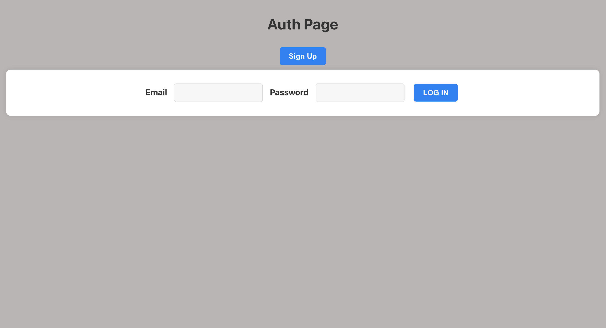
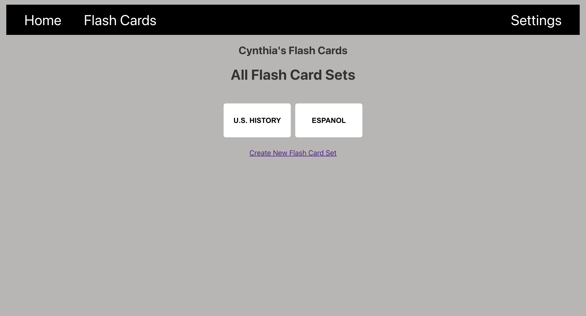
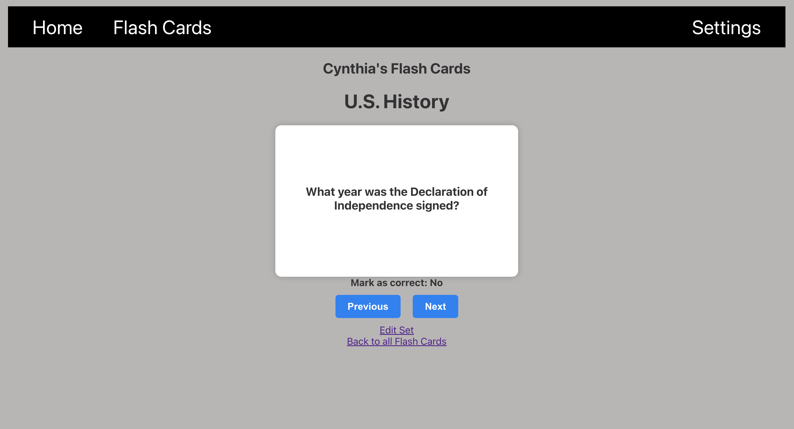
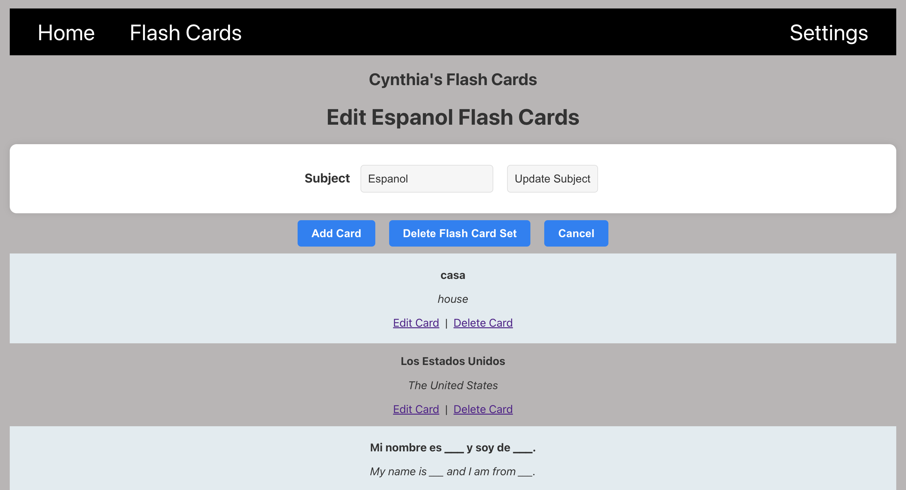
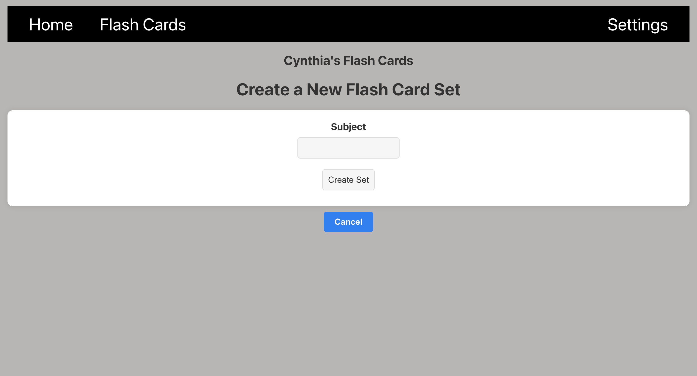

# Flash Card App

## Introduction

The Flash Card App is a web application designed to help users create, manage, and study flashcards. It provides an intuitive interface for creating flashcards, organizing them into sets by subject, and flipping through them to reinforce learning. Whether you're a student preparing for exams or simply looking to memorize important information, the Flash Card App has you covered.

## Screenshots

+----------------+     +---------------------+     +----------------+
|     Users      |     |    FlashCardSets    |     |   FlashCards   |
+----------------+     +---------------------+     +----------------+
| - UserID       |     | - SetID             |     | - CardID        |
| - Username     |     | - Subject           |     | - Question      |
| - Email        |     |                     |     | - Answer        |
|                |     | - UserID (FK)       |     | - SetID (FK)    |
+----------------+     +---------------------+     +----------------+

## Technologies Used

The Flash Card App is built using the following technologies:

- **React.js**: The front-end of the application is developed using React.js, a popular JavaScript library for building user interfaces.

- **Node.js**: Node.js is used for the back-end server, handling API requests and interactions with the database.

- **Express.js**: Express.js is a web application framework for Node.js that simplifies the process of building robust APIs.

- **MongoDB**: MongoDB serves as the database for storing flashcards and their associated data.

- **HTML5, CSS3, JavaScript**: These fundamental web technologies are used for structuring, styling, and enhancing the user interface and interactivity of the application.

## Getting Started

To get started with the Flash Card App, you can:

- View the project's planning and progress on my [Trello board](https://trello.com/invite/b/ZRAhsI7w/ATTIe064deeddb3d9b052dde646d3a9c688aE11C4195/flash-card-app){:target="_blank"}.

- Access the deployed application at [Flash Card App](https://flash-cards-app-6qim.onrender.com/){:target="_blank"}.

## Unsolved Problems

Currently, the Flash Card App does not support features to update and delete individual flash cards. In future versions, we plan to implement these features to enhance the user experience.

## Future Enhancements

In the upcoming releases of the Flash Card App, we plan to introduce the following enhancements:

- **Improved Card Set Organization**: We aim to provide more robust card set organization and categorization features, making it easier for users to manage their flashcards.

- **Integration with Learning Resources**: The app will integrate with external learning resources and APIs, allowing users to access additional study materials and resources.

- **Mobile Applications**: We plan to develop mobile application versions of the Flash Card App for both iOS and Android platforms, enabling users to study on the go.

- **Accessibility Features**: We will introduce accessibility features such as a light/dark mode toggle, pomodoro studying timer, customizable font size and family, and the ability to shuffle cards for improved study focus.

- **Collaboration and User Groups**: We will implement features that allow users to create groups and collaborate with other users on flashcard sets, enhancing the collaborative learning experience.

We also welcome contributions from the open-source community to help make the Flash Card App even better!
